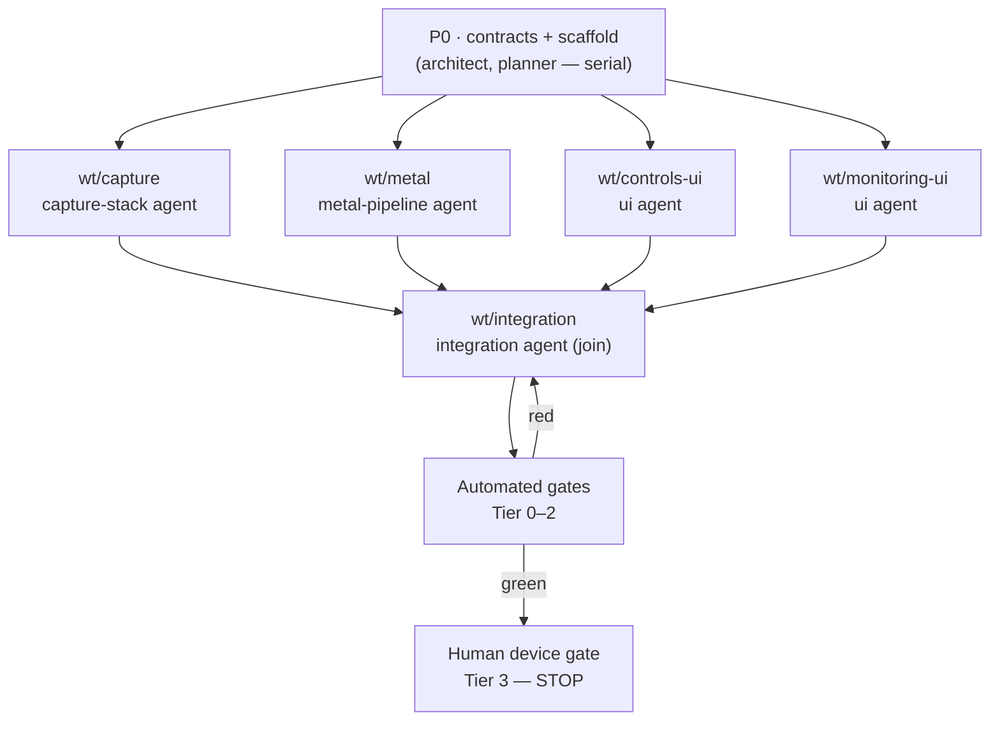

# RAWCamera — Autonomous Build Plan

A multi-agent build plan for an iOS RAW/ProRAW camera app with manual controls
(shutter, ISO, white balance, focus) and capture-time monitoring (zebra, focus
peaking, live histogram, level guide), built on SwiftUI + AVFoundation + Metal +
CoreMotion. Assumes the ECC primitives are installed (agents, skills, hooks,
`autonomous-loops`, `loop-operator`, memory-persistence,
`continuous-learning-v2`, status snapshots).

> **Read this first — the autonomy ceiling.** The Simulator has no camera and
> RAW capture cannot run headlessly, so **no automated grader can verify live
> capture behavior.** Agents can autonomously reach a state that *compiles,
> passes unit tests, and is statically clean.* The final "the camera actually
> does the thing" gate is a **human on a physical device** (Phase 4). Everything
> below is designed to (1) maximize the machine-checkable surface and (2) reduce
> the human gate to a 60-second checklist. Do not let an agent claim "done"
> before the device gate.

---

## 1. Architecture for verifiability

The single most important decision is to split the code so that logic is
testable without a camera:

| Target | Depends on | Testable headless? | Holds |
| --- | --- | --- | --- |
| `CameraCore` (Swift package, no Apple media frameworks) | Foundation, simd | **Yes — fully** | clamp math, WB gain math, histogram normalization, level math, RAW-format selection (over an injected format list), `PreviewUniforms` layout constants |
| `RAWCamera` (app target) | AVFoundation, Metal, MetalKit, CoreMotion, Photos, SwiftUI | No (needs device) | `CaptureService`, `CameraMetalView`, shaders, SwiftUI views, the view-model shell |
| `CameraCoreTests` (XCTest) | `CameraCore` | **Yes** | all Tier-1 graders |

Every worker pushes pure logic *down* into `CameraCore` and keeps the app-layer
files thin. This is what makes the build autonomously gradeable up to the device
gate.

---

## 2. Module decomposition + ownership map

Four parallel modules + one integration module. **No two agents write the same
file** — ownership is exclusive per worktree.

| Module | Worktree | Owns (files) | Core logic it pushes into `CameraCore` |
| --- | --- | --- | --- |
| Capture stack | `wt/capture` | `Capture/CaptureService.swift`, `Capture/PhotoCaptureProcessor.swift` | exposure clamp, WB gain clamp/build, RAW-format selection |
| Metal preview | `wt/metal` | `Monitoring/CameraMetalView.swift`, `Monitoring/CameraShaders.metal` | histogram normalization, `PreviewUniforms` layout |
| Controls UI | `wt/controls-ui` | `UI/ControlsPanel.swift` | (binds to model only — no logic) |
| Monitoring UI | `wt/monitoring-ui` | `UI/HistogramView.swift`, `UI/LevelGuideView.swift`, `Monitoring/MotionManager.swift` | level math (gravity → roll/pitch) |
| Integration | `wt/integration` (serial, Phase 2) | `RAWCameraApp.swift`, `CameraModel.swift`, `UI/CameraScreen.swift`, `Info.plist`, glue | — |

---

## 3. Phase 0 — frozen contracts (serial, one merged commit)

Nothing forks until `architect` + `planner` land **`CONTRACTS.md`** + the Xcode
project scaffold + `CameraCore` with protocol stubs that compile. The parallel
phase is only safe because every worktree branches from this single commit.

Freeze, at minimum:

- **`CaptureService` public API** — every method the model calls, plus the frame
  hand-off: `var onVideoFrame: ((CVPixelBuffer) -> Void)?`, and `ExposureLimits`.
- **`CameraModel` published surface** — the `@Published` state the UI binds to and
  the intent methods it calls (`capturePhoto()`, `focusTap(at:)`, the manual
  toggles). UI agents code against this, not against `CaptureService`.
- **`PreviewUniforms` byte layout** — the struct shared between Swift and the
  `.metal` file. **This is the critical ABI contract**; field order, types, and
  `stride` are frozen here and grader T1-7 enforces parity.
- **`HistogramData`** shape (256 bins × R/G/B/luma, normalized 0…1).
- **Module file map** (section 2) — ownership is contractual.
- **Targets**: app + `CameraCore` package + `CameraCoreTests`.

Output of Phase 0: a repo that builds empty shells green. Merge before forking.

---

## 4. Worktree / DAG layout



- **Phase 1 is genuinely parallel**: each worktree depends only on the frozen
  `CONTRACTS.md`, so four `loop-operator` instances run concurrently in separate
  `git worktree` checkouts off the Phase-0 commit.
- A worktree merges back only when its own Tier 0–1 gates are green (PR loop).
- **Phase 2 (`wt/integration`) is a join node** — it starts only after all four
  Phase-1 branches merge, wires them through `CameraModel`, and resolves real
  integration (this is where ABI/contract drift surfaces).
- **Phase 3** runs the full Tier 0–2 suite on the integrated branch; failures
  bounce back to integration (or to the owning module if isolated).
- **Phase 4** is the human device gate. The orchestrator **pauses here** and
  emits the checklist; it does not self-certify.

---

## 5. Agent roster

| Role | ECC primitive | Phase | Scope |
| --- | --- | --- | --- |
| **Orchestrator** | `loop-operator` + `autonomous-loops` (DAG) + `/orchestrate-worktrees.js` | all | owns the DAG, spawns worktrees, dispatches workers, enforces the merge rule, drives the loop, stops at the device gate |
| **Architect** | `architect` agent + `rules/swift` | 0 | authors `CONTRACTS.md`, the `PreviewUniforms` ABI, the `CameraCore` boundary |
| **Planner** | `planner` agent | 0 | turns this doc into the task graph + per-worktree briefs |
| **Capture-stack worker** | implementer + `rules/swift` + `search-first` | 1 | `wt/capture`; AVFoundation, RAW/ProRAW config, manual controls, Photos save |
| **Metal-pipeline worker** | implementer + `rules/swift` (+ `search-first` for MTKView/CVMetalTextureCache) | 1 | `wt/metal`; the highest-risk module — shaders, texture cache, histogram readback |
| **Controls-UI worker** | implementer + `rules/swift` + `liquid-glass-design` (optional) | 1 | `wt/controls-ui`; SwiftUI sliders/toggles bound to the model |
| **Monitoring-UI worker** | implementer + `rules/swift` | 1 | `wt/monitoring-ui`; histogram `Canvas`, level guide, CoreMotion |
| **Integration worker** | implementer + `architect` consult | 2 | `wt/integration`; glue, permissions, full build |
| **TDD guide** | `tdd-guide` + `tdd-workflow` skill | 0–1 | writes `CameraCoreTests` first; every `CameraCore` function lands test-first |
| **Code reviewer** | `code-reviewer` (define a `swift-reviewer` agent — ECC ships TS/Go/Py/etc. reviewers but **not Swift**, so add one using `rules/swift`) | gate | quality + threading discipline on every PR |
| **Security reviewer** | `security-reviewer` + `/security-scan` (AgentShield) | gate | privacy strings, entitlements, no networking, no secrets |
| **Build resolver** | `build-error-resolver` | gate | `xcodebuild` + `metal` compile failures |
| **Learner** | `continuous-learning-v2` (`/instinct-status`, `/evolve`) | all | captures Swift/Metal pitfalls into instincts so reruns improve |

> Note: ECC has no built-in Swift reviewer agent. Phase 0 should generate a
> `swift-reviewer` agent definition from `rules/swift` (e.g. via `/skill-create`)
> before the gates run, or fall back to `code-reviewer` with the Swift rules loaded.

---

## 6. Grader set

Merge rule: **a PR merges only when every *automatable* gate at its tier and below
is green.** `pass@k` applies to Tiers 0–2. Tier 3 is human and is never
auto-satisfied.

### Tier 0 — build gates (every PR, cheapest + highest signal)
| ID | Gate | Command | Auto |
| --- | --- | --- | --- |
| T0-1 | App compiles for device SDK | `xcodebuild -scheme RAWCamera -sdk iphoneos -destination 'generic/platform=iOS' build` | ✅ |
| T0-2 | Metal shaders compile | `xcrun -sdk iphoneos metal -c Monitoring/CameraShaders.metal -o /dev/null` | ✅ |
| T0-3 | Lint/format clean | `swiftlint --strict` (+ `swift-format lint`) | ✅ |

### Tier 1 — `CameraCore` unit tests (host/Simulator, no camera)
| ID | Gate | What it proves | Auto |
| --- | --- | --- | --- |
| T1-1 | Exposure clamp | shutter & ISO clamp into the active-format range — never set out-of-range (which throws at runtime) | ✅ |
| T1-2 | WB gain clamp | every channel stays in `1.0…maxGain`; temp/tint → gains is finite & in-range | ✅ |
| T1-3 | Histogram normalization | bins normalize to 0…1; max bin → 1; empty frame ⇒ no divide-by-zero | ✅ |
| T1-4 | Level math | known gravity vectors → expected roll/pitch; `isLevel` threshold correct | ✅ |
| T1-5 | RAW-format selection | over an injected format list, picks ProRAW vs Bayer correctly; falls back when ProRAW absent | ✅ |
| T1-6 | Contract conformance | each module type satisfies the protocol surface frozen in `CONTRACTS.md` (compile-time conformance test) | ✅ |
| **T1-7** | **Uniform ABI parity** | `MemoryLayout<PreviewUniforms>.stride` + field offsets match the agreed Metal layout — guards the Swift↔Metal struct from silent drift | ✅ |

### Tier 2 — static / structural
| ID | Gate | What it proves | Auto |
| --- | --- | --- | --- |
| T2-1 | Privacy keys present | `Info.plist` has `NSCameraUsageDescription` + `NSPhotoLibraryAddUsageDescription` | ✅ |
| T2-2 | No network / no exfil | no `URLSession`/socket/analytics in the tree (security-reviewer + grep) | ✅ |
| T2-3 | No deprecated orientation API | uses `videoRotationAngle`, not `videoOrientation` (architectural rule) | ✅ |
| T2-4 | Threading discipline | session work off the main thread; `@Published` writes on main (reviewer + targeted asserts) | ⚠️ partial |

### Tier 3 — human device gate (cannot be automated)
Orchestrator emits this checklist and **stops**:
- [ ] ProRAW capture saves a DNG that opens in Photos / Lightroom
- [ ] Bayer RAW capture saves a DNG (on a device that lacks ProRAW, or with it off)
- [ ] Manual shutter & ISO visibly change exposure; auto ⇄ manual toggles cleanly
- [ ] White-balance slider shifts color; focus slider racks focus end to end
- [ ] Zebra stripes appear on blown highlights at threshold; toggle works
- [ ] Focus peaking highlights in-focus edges and tracks as you rack focus
- [ ] Live histogram tracks the scene; RGB + luma channels look right
- [ ] Level guide reads ~0° on a flat surface; tracks tilt
- [ ] No frame-rate collapse with all overlays on (check thermals)

---

## 7. Per-worktree task brief (template the planner fills in)

```
WORKTREE: wt/<module>
BRANCH FROM: <phase-0 commit sha>
OWNS (exclusive): <files from section 2>
CONTRACTS: read CONTRACTS.md — code against the frozen API only.
PUSH-DOWN: move <listed logic> into CameraCore + write its tests FIRST (tdd-guide).
DONE = Tier 0 green AND your Tier 1 tests green AND code-reviewer approves.
DO NOT touch files outside OWNS. If you need a contract change, STOP and raise it
to the orchestrator — do not edit CONTRACTS.md unilaterally.
```

---

## 8. Operating notes

- **State / dashboard**: run `ecc status --markdown --write status.md` between
  phases; use `ecc work-items sync-github` so the PR queue is visible. Treat
  `status.md` as the source of truth, not chat scrollback.
- **Memory**: rely on the memory-persistence hooks so workers don't re-derive the
  contracts each session; the frozen `CONTRACTS.md` is the durable anchor.
- **Failure handling**: a red gate bounces to the owning worktree if the failure
  is isolated, else to `wt/integration`. Cap retries (e.g. `pass@3`) before
  escalating to a human note in `status.md`.
- **Contract drift is the #1 risk** — especially T1-7 (the Metal uniform layout).
  If two modules disagree, the fix is a contract amendment in Phase 0 space
  (orchestrator-mediated), never an ad-hoc edit in a worktree.
- **Learning**: after the run, `/evolve` the captured instincts into a Swift/Metal
  skill so the next camera-app build starts smarter.
